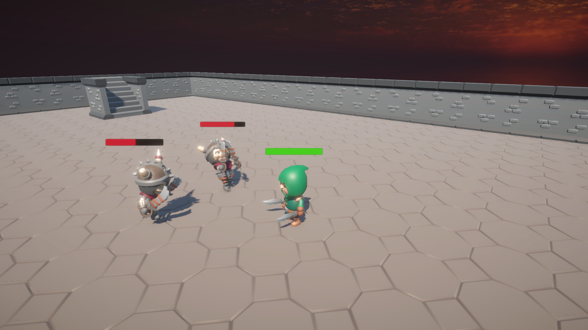

# 3DRPG
**3DRPG** is a compact 3D Unity game prototype that demonstrates core gameplay systems including procedural level generation, a player character controller with an object-oriented finite state machine, and enemy AI. This project serves as a demonstration of gameplay programming, AI behavior scripting, and system design in Unity.

## 🧩 Features
- **Procedural World Generation**
    - Simple script dynamically generates floors and walls to form a basic dungeon-like environment.

- **Player Controller**
    - Built using an object-oriented **Finite State Machine (FSM)**.
    - Player actions include:
        - Walk
        - Run
        - Dodge
        - Jump
        - Attack

- **Enemy AI**
    - Enemies detect and chase the player when within a specified range.
    - If close enough, enemies attack the player.
    - FSM-driven behavior for AI control.

- **Combat & Health System**
    - Both player and enemies have responsive health bars.
    - Damage taken during attacks reduces health.
    - Characters "die" when health reaches zero and revive after a short cooldown period.



## 📦 Dependencies & Assets
This project utilizes freely available assets under the appropriate licenses:
- [KayKit Adventurers](https://kaylousberg.itch.io/kaykit-adventurers)
- [KayKit Skeletons](https://kaylousberg.itch.io/kaykit-skeletons)
- [KayKit Dungeon Remastered](https://kaylousberg.itch.io/kaykit-dungeon-remastered)
- [AllSky - Free 10 Sky Skybox Set](https://assetstore.unity.com/packages/2d/textures-materials/sky/allsky-free-10-sky-skybox-set-146014)

> 🎨 All art assets belong to their respective creators. This project uses them for non-commercial and educational purposes.

## 🚀 Getting Started

To run this project locally:

1. **Clone the repository**:
    ```
    git clone https://github.com/vaemnor/3DRPG.git
    ```

2. **Open in Unity**:
    - Launch **Unity 6 (Version 6000.0.24f1)**.
    - Open the cloned project folder in the Unity Hub or from the Unity editor directly.

3. **Play the Game**:
    - Open the main scene (e.g., `SampleScene.unity`).
    - Press `Play` to test the game and interact with the systems.

> ⚠️ This project was built and tested using Unity 6 Version 6000.0.24f1. Using an earlier version may result in compatibility issues.

## 🎮 Controls

| Action         | Key(s)                       |
|----------------|------------------------------|
| Walk           | `W` / `A` / `S` / `D`        |
| Run            | `CTRL` + Movement Keys       |
| Dodge          | `Left Shift` + Movement Keys |
| Jump           | `Spacebar`                   |
| Attack         | `Left Click`                 |

## 📃 License
This project is provided for educational and portfolio purposes only and is not intended for commercial distribution.
